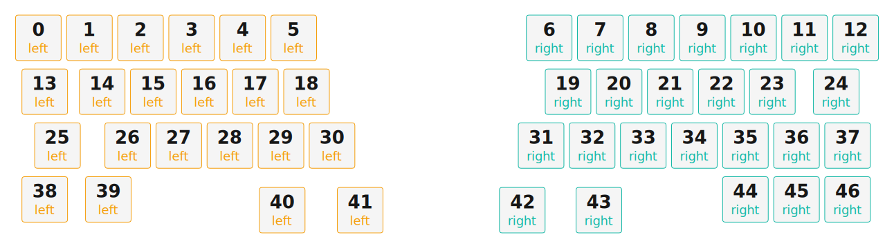

# ZMK Configuration for Caeseura

*Generated by Shield Wizard for ZMK*



Download compiled firmware from the Actions tab. <https://zmk.dev/docs/user-setup#installing-the-firmware>

Edit your keymap <https://zmk.dev/docs/keymaps>.
User keymap is located at [`config/caeseura.keymap`](config/caeseura.keymap).

-----

<details>
<summary>
Shield Wizard Debug Information
</summary>

In case of broken configuration, here is the Shield Wizard internal data used to generate this configuration:

Commit: 8a52249f61161469b6d90ed8c80c4aa52b9f3858

```json
{"name":"Caeseura","shield":"caeseura","dongle":false,"modules":[],"layout":[{"id":"01KJEWSTA2WSGJPKTC9RK0804X","part":0,"row":0,"col":0,"w":1,"h":1,"x":-10,"y":0,"r":0,"rx":0,"ry":0},{"id":"01KJEWSTA2ZQ8XTTBYFGZP5PSZ","part":0,"row":0,"col":1,"w":1,"h":1,"x":-8.944,"y":0,"r":0,"rx":0,"ry":0},{"id":"01KJEWSTA2C88EE1QST33JA1P6","part":0,"row":0,"col":2,"w":1,"h":1,"x":-7.889,"y":0,"r":0,"rx":0,"ry":0},{"id":"01KJEWSTA2G5R2BWYK12CTZR03","part":0,"row":0,"col":3,"w":1,"h":1,"x":-6.833,"y":0,"r":0,"rx":0,"ry":0},{"id":"01KJEWSTA21AFNH5VCJ36AK0GV","part":0,"row":0,"col":4,"w":1,"h":1,"x":-5.778,"y":0,"r":0,"rx":0,"ry":0},{"id":"01KJEWSTA2W56V2A9YR1CV8M3E","part":0,"row":0,"col":5,"w":1,"h":1,"x":-4.722,"y":0,"r":0,"rx":0,"ry":0},{"id":"01KJEWSTA2ES13WSG7RSGPF13B","part":1,"row":0,"col":6,"w":1,"h":1,"x":0.556,"y":0,"r":0,"rx":0,"ry":0},{"id":"01KJEWSTA2R7YCBS51QP8ZYZ7D","part":1,"row":0,"col":7,"w":1,"h":1,"x":1.611,"y":0,"r":0,"rx":0,"ry":0},{"id":"01KJEWSTA2TFBK0J2W7EZJKC5F","part":1,"row":0,"col":8,"w":1,"h":1,"x":2.667,"y":0,"r":0,"rx":0,"ry":0},{"id":"01KJEWSTA2DXHBZF197RBKKWGA","part":1,"row":0,"col":9,"w":1,"h":1,"x":3.722,"y":0,"r":0,"rx":0,"ry":0},{"id":"01KJEWSTA2T3FJJ22BCS2JE90N","part":1,"row":0,"col":10,"w":1,"h":1,"x":4.778,"y":0,"r":0,"rx":0,"ry":0},{"id":"01KJEWSTA2P0ZJ9EZSFYXTD83C","part":1,"row":0,"col":11,"w":1,"h":1,"x":5.833,"y":0,"r":0,"rx":0,"ry":0},{"id":"01KJEWSTA21GZ6KJEF5EMBP04D","part":1,"row":0,"col":12,"w":1,"h":1,"x":6.889,"y":0,"r":0,"rx":0,"ry":0},{"id":"01KJEWSTA21TCHPA67XRTKVNZ1","part":0,"row":1,"col":0,"w":1,"h":1,"x":-9.868,"y":1.118,"r":0,"rx":0,"ry":0},{"id":"01KJEWSTA292T44RCXD0JPR47B","part":0,"row":1,"col":1,"w":1,"h":1,"x":-8.681,"y":1.118,"r":0,"rx":0,"ry":0},{"id":"01KJEWSTA24PVX6M598WA1QNJP","part":0,"row":1,"col":2,"w":1,"h":1,"x":-7.625,"y":1.118,"r":0,"rx":0,"ry":0},{"id":"01KJEWSTA2TQ3HEGQECEQQF0VR","part":0,"row":1,"col":3,"w":1,"h":1,"x":-6.569,"y":1.118,"r":0,"rx":0,"ry":0},{"id":"01KJEWSTA2D1HMF334DAMVJ7CN","part":0,"row":1,"col":4,"w":1,"h":1,"x":-5.514,"y":1.118,"r":0,"rx":0,"ry":0},{"id":"01KJEWSTA27SRSSCDMWXE4JTVZ","part":0,"row":1,"col":5,"w":1,"h":1,"x":-4.458,"y":1.118,"r":0,"rx":0,"ry":0},{"id":"01KJEWSTA2H7VHF5TAGFCWHR83","part":1,"row":1,"col":6,"w":1,"h":1,"x":0.946,"y":1.118,"r":0,"rx":0,"ry":0},{"id":"01KJEWSTA2H20N2C6QSN041Y61","part":1,"row":1,"col":7,"w":1,"h":1,"x":2.002,"y":1.118,"r":0,"rx":0,"ry":0},{"id":"01KJEWSTA2ZA9CGH6RQDM98WP8","part":1,"row":1,"col":8,"w":1,"h":1,"x":3.057,"y":1.118,"r":0,"rx":0,"ry":0},{"id":"01KJEWSTA28KYFTZ1JEKM1T4DR","part":1,"row":1,"col":9,"w":1,"h":1,"x":4.113,"y":1.118,"r":0,"rx":0,"ry":0},{"id":"01KJEWSTA2THR0P5A34MPB1QS1","part":1,"row":1,"col":10,"w":1,"h":1,"x":5.168,"y":1.118,"r":0,"rx":0,"ry":0},{"id":"01KJEWSTA20MWT175GMZAQT9SH","part":1,"row":1,"col":11,"w":1,"h":1,"x":6.488,"y":1.118,"r":0,"rx":0,"ry":0},{"id":"01KJEWSTA299AXM0DHS4MQ8TJK","part":0,"row":2,"col":0,"w":1,"h":1,"x":-9.604,"y":2.235,"r":0,"rx":0,"ry":0},{"id":"01KJEWSTA2M2N71XEZR4HPK0W6","part":0,"row":2,"col":1,"w":1,"h":1,"x":-8.153,"y":2.235,"r":0,"rx":0,"ry":0},{"id":"01KJEWSTA2DJFHSKAZW4RR8BVA","part":0,"row":2,"col":2,"w":1,"h":1,"x":-7.097,"y":2.235,"r":0,"rx":0,"ry":0},{"id":"01KJEWSTA20ZCJ6W2HSM25F4P7","part":0,"row":2,"col":3,"w":1,"h":1,"x":-6.042,"y":2.235,"r":0,"rx":0,"ry":0},{"id":"01KJEWSTA2MBDPN0T132J9TN9R","part":0,"row":2,"col":4,"w":1,"h":1,"x":-4.986,"y":2.235,"r":0,"rx":0,"ry":0},{"id":"01KJEWSTA216C8V17B20HJKZDJ","part":0,"row":2,"col":5,"w":1,"h":1,"x":-3.931,"y":2.235,"r":0,"rx":0,"ry":0},{"id":"01KJEWSTA28NBBCRCYW7ZXF3M2","part":1,"row":2,"col":6,"w":1,"h":1,"x":0.389,"y":2.235,"r":0,"rx":0,"ry":0},{"id":"01KJEWSTA23FXD1VXMPVAH9RP0","part":1,"row":2,"col":7,"w":1,"h":1,"x":1.444,"y":2.235,"r":0,"rx":0,"ry":0},{"id":"01KJEWSTA2F8Y84D5SXWWX4PK8","part":1,"row":2,"col":8,"w":1,"h":1,"x":2.5,"y":2.235,"r":0,"rx":0,"ry":0},{"id":"01KJEWSTA2YW7S3QYV2QCXJQKW","part":1,"row":2,"col":9,"w":1,"h":1,"x":3.556,"y":2.235,"r":0,"rx":0,"ry":0},{"id":"01KJEWSTA2RJGC1BJTTPVNAVV4","part":1,"row":2,"col":10,"w":1,"h":1,"x":4.611,"y":2.235,"r":0,"rx":0,"ry":0},{"id":"01KJEWSTA25J43D66Q70EFGXG6","part":1,"row":2,"col":11,"w":1,"h":1,"x":5.667,"y":2.235,"r":0,"rx":0,"ry":0},{"id":"01KJEWSTA2C54XKHV0RGHAS2NJ","part":1,"row":2,"col":12,"w":1,"h":1,"x":6.722,"y":2.235,"r":0,"rx":0,"ry":0},{"id":"01KJEWSTA2QAYRH0BNK577YBGJ","part":0,"row":3,"col":0,"w":1,"h":1,"x":-9.868,"y":3.353,"r":0,"rx":0,"ry":0},{"id":"01KJEWSTA21G4BVSW8682JX6P5","part":0,"row":3,"col":1,"w":1,"h":1,"x":-8.554,"y":3.353,"r":0,"rx":0,"ry":0},{"id":"01KJEWSTA2S40B1S4S66GGR2KC","part":0,"row":3,"col":4,"w":1,"h":1,"x":-4.961,"y":3.576,"r":0,"rx":0,"ry":0},{"id":"01KJEWSTA20YM5P2QC0KJ4WFHA","part":0,"row":3,"col":5,"w":1,"h":1,"x":-3.35,"y":3.576,"r":0,"rx":0,"ry":0},{"id":"01KJEWSTA2MYZP26JJ3H6RK6KW","part":1,"row":3,"col":6,"w":1,"h":1,"x":0,"y":3.576,"r":0,"rx":0,"ry":0},{"id":"01KJEWSTA2V0EV06EGKYDJBW3G","part":1,"row":3,"col":7,"w":1,"h":1,"x":1.583,"y":3.576,"r":0,"rx":0,"ry":0},{"id":"01KJEWSTA2WJKBQ5BQ5GR7PT27","part":1,"row":3,"col":10,"w":1,"h":1,"x":4.611,"y":3.353,"r":0,"rx":0,"ry":0},{"id":"01KJEWSTA2W9J5XBYBK5B0S5GC","part":1,"row":3,"col":11,"w":1,"h":1,"x":5.667,"y":3.353,"r":0,"rx":0,"ry":0},{"id":"01KJEWSTA2M5JD10PPGRHJZ0V6","part":1,"row":3,"col":12,"w":1,"h":1,"x":6.722,"y":3.353,"r":0,"rx":0,"ry":0}],"parts":[{"name":"left","controller":"nice_nano_v2","wiring":"matrix_diode","pins":{"d4":"output","d3":"output","d2":"output","d1":"output","d0":"output","d6":"input","d7":"input","d8":"input","d5":"output","d9":"input"},"keys":{"01KJEWSTA2W56V2A9YR1CV8M3E":{"input":"d6","output":"d5"},"01KJEWSTA27SRSSCDMWXE4JTVZ":{"input":"d7","output":"d5"},"01KJEWSTA216C8V17B20HJKZDJ":{"input":"d8","output":"d5"},"01KJEWSTA21AFNH5VCJ36AK0GV":{"input":"d6","output":"d4"},"01KJEWSTA2D1HMF334DAMVJ7CN":{"input":"d7","output":"d4"},"01KJEWSTA2MBDPN0T132J9TN9R":{"input":"d8","output":"d4"},"01KJEWSTA2G5R2BWYK12CTZR03":{"input":"d6","output":"d3"},"01KJEWSTA2TQ3HEGQECEQQF0VR":{"input":"d7","output":"d3"},"01KJEWSTA20ZCJ6W2HSM25F4P7":{"input":"d8","output":"d3"},"01KJEWSTA2C88EE1QST33JA1P6":{"input":"d6","output":"d2"},"01KJEWSTA2DJFHSKAZW4RR8BVA":{"input":"d8","output":"d2"},"01KJEWSTA24PVX6M598WA1QNJP":{"input":"d7","output":"d2"},"01KJEWSTA2ZQ8XTTBYFGZP5PSZ":{"input":"d6","output":"d1"},"01KJEWSTA292T44RCXD0JPR47B":{"input":"d7","output":"d1"},"01KJEWSTA2M2N71XEZR4HPK0W6":{"input":"d8","output":"d1"},"01KJEWSTA21G4BVSW8682JX6P5":{"input":"d9","output":"d1"},"01KJEWSTA2WSGJPKTC9RK0804X":{"input":"d6","output":"d0"},"01KJEWSTA21TCHPA67XRTKVNZ1":{"input":"d7","output":"d0"},"01KJEWSTA299AXM0DHS4MQ8TJK":{"input":"d8","output":"d0"},"01KJEWSTA2QAYRH0BNK577YBGJ":{"input":"d9","output":"d0"},"01KJEWSTA20YM5P2QC0KJ4WFHA":{"input":"d9","output":"d5"},"01KJEWSTA2S40B1S4S66GGR2KC":{"input":"d9","output":"d4"}},"encoders":[],"buses":[{"name":"spi0","devices":[],"type":"spi"},{"name":"spi1","devices":[],"type":"spi"},{"name":"spi2","devices":[],"type":"spi"},{"name":"spi3","devices":[],"type":"spi"},{"name":"i2c0","devices":[],"type":"i2c"},{"name":"i2c1","devices":[],"type":"i2c"}]},{"name":"right","controller":"nice_nano_v2","wiring":"matrix_diode","pins":{"d1":"output","d0":"output","d2":"output","d3":"output","d4":"output","d5":"output","d6":"output","d7":"input","d8":"input","d9":"input","d10":"input","d14":"input"},"keys":{"01KJEWSTA2R7YCBS51QP8ZYZ7D":{"input":"d7","output":"d1"},"01KJEWSTA2H20N2C6QSN041Y61":{"input":"d8","output":"d1"},"01KJEWSTA2V0EV06EGKYDJBW3G":{"input":"d14","output":"d1"},"01KJEWSTA23FXD1VXMPVAH9RP0":{"input":"d9","output":"d1"},"01KJEWSTA2MYZP26JJ3H6RK6KW":{"input":"d14","output":"d0"},"01KJEWSTA28NBBCRCYW7ZXF3M2":{"input":"d9","output":"d0"},"01KJEWSTA2H7VHF5TAGFCWHR83":{"input":"d8","output":"d0"},"01KJEWSTA2ES13WSG7RSGPF13B":{"input":"d7","output":"d0"},"01KJEWSTA2F8Y84D5SXWWX4PK8":{"input":"d9","output":"d2"},"01KJEWSTA2ZA9CGH6RQDM98WP8":{"input":"d8","output":"d2"},"01KJEWSTA2TFBK0J2W7EZJKC5F":{"input":"d7","output":"d2"},"01KJEWSTA2YW7S3QYV2QCXJQKW":{"input":"d9","output":"d3"},"01KJEWSTA28KYFTZ1JEKM1T4DR":{"input":"d8","output":"d3"},"01KJEWSTA2DXHBZF197RBKKWGA":{"input":"d7","output":"d3"},"01KJEWSTA2WJKBQ5BQ5GR7PT27":{"input":"d10","output":"d4"},"01KJEWSTA2RJGC1BJTTPVNAVV4":{"input":"d9","output":"d4"},"01KJEWSTA2T3FJJ22BCS2JE90N":{"input":"d7","output":"d4"},"01KJEWSTA2THR0P5A34MPB1QS1":{"input":"d8","output":"d4"},"01KJEWSTA2W9J5XBYBK5B0S5GC":{"input":"d10","output":"d5"},"01KJEWSTA25J43D66Q70EFGXG6":{"input":"d9","output":"d5"},"01KJEWSTA20MWT175GMZAQT9SH":{"input":"d8","output":"d5"},"01KJEWSTA2P0ZJ9EZSFYXTD83C":{"input":"d7","output":"d5"},"01KJEWSTA2M5JD10PPGRHJZ0V6":{"input":"d10","output":"d6"},"01KJEWSTA2C54XKHV0RGHAS2NJ":{"input":"d9","output":"d6"},"01KJEWSTA21GZ6KJEF5EMBP04D":{"input":"d7","output":"d6"}},"encoders":[],"buses":[{"name":"spi0","devices":[],"type":"spi"},{"name":"spi1","devices":[],"type":"spi"},{"name":"spi2","devices":[],"type":"spi"},{"name":"spi3","devices":[],"type":"spi"},{"name":"i2c0","devices":[],"type":"i2c"},{"name":"i2c1","devices":[],"type":"i2c"}]}]}
```

</details>
